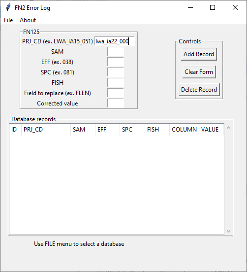
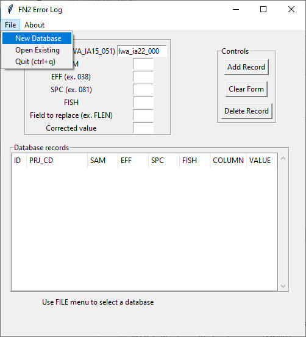
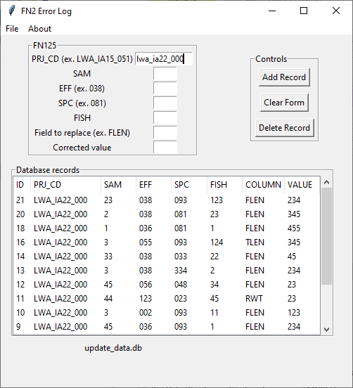
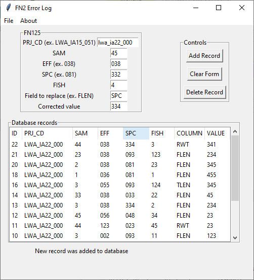
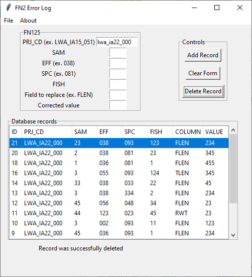

# Data Change GUI

## Introduction  
The Data Change GUI is a lightweight sqlite data base with a tkinter GUI that is used to record required data changes to FN2 FN125 files. Changes are recorded in the database and then in R, a rows_update() applies the changes to the data along with additional cleaning and standardization routines. Changes are recorded in the database and will later be merged using R along with additional cleaning and standardization routines as the data are migrated to a long term storage system. In this manner, raw data can remain unchanged while creating a documented, reproducible pipeline of data changes.

1.  Opening splash page   

2.  Create new or open an existing database   
On load, you can create a new database or load an existing database from options in the File menu. 
  

3.  View current records     
  

4.  Add a new data change   
You can move between entry boxes using "TAB". New records are added to the database via the "Submit" button (on click or with "ENTER" when highlighted). Currently, errors can only be deleted and not edited (at least not from this GUI - see DBBrowser software to interact with update_data.db if required). To delete a record, highlight the record in the spreadsheet window that is intended to be deleted and then click "Delete".  

5. Delete a record  
To delete a record, highlight the record in the spreadsheet window that is intended to be deleted and then click "Delete".    

